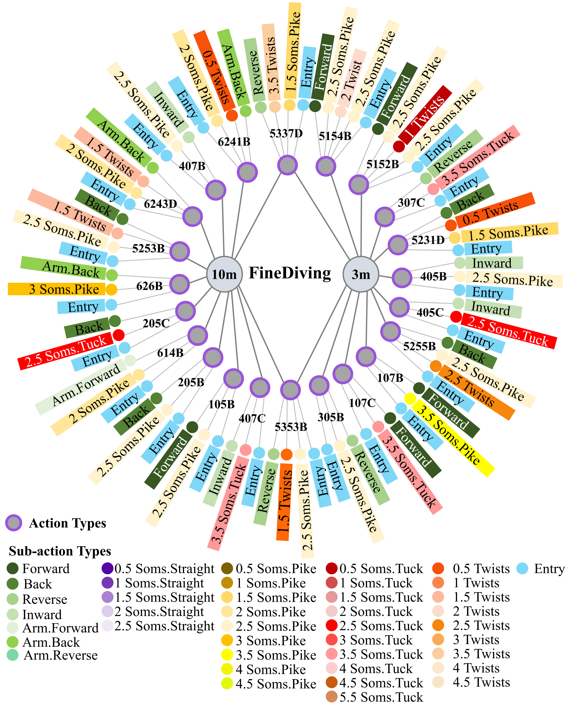
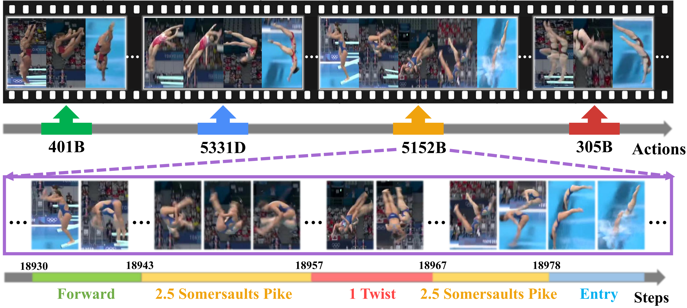

# FineDiving: A Fine-grained Dataset for Procedure-aware Action Quality Assessment

This repository contains FineDiving dataset and PyTorch implementation for Temporal Segmentation Attention (TSA). (CVPR 2022)

## Dataset

### Lexicon
We construct a fine-grained video dataset organized by both semantic and temporal structures, where each structure contains two-level annotations, shown in Figures \ref{semantic} and \ref{temporal}. Herein, we employ three professional athletes of the diving association, who have prior knowledge in diving and help to construct a lexicon for subsequent annotation.

